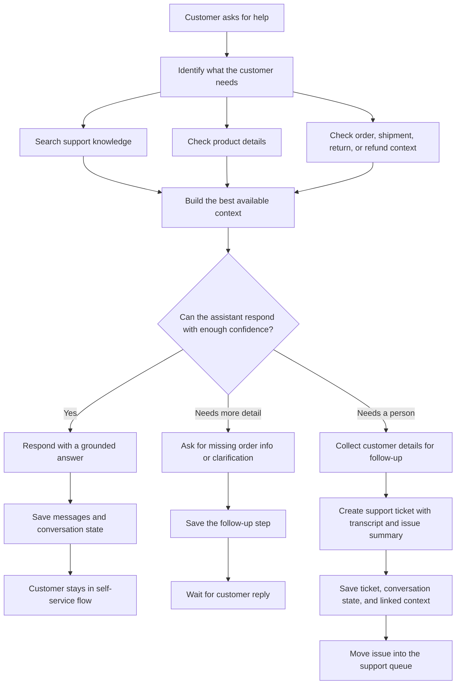
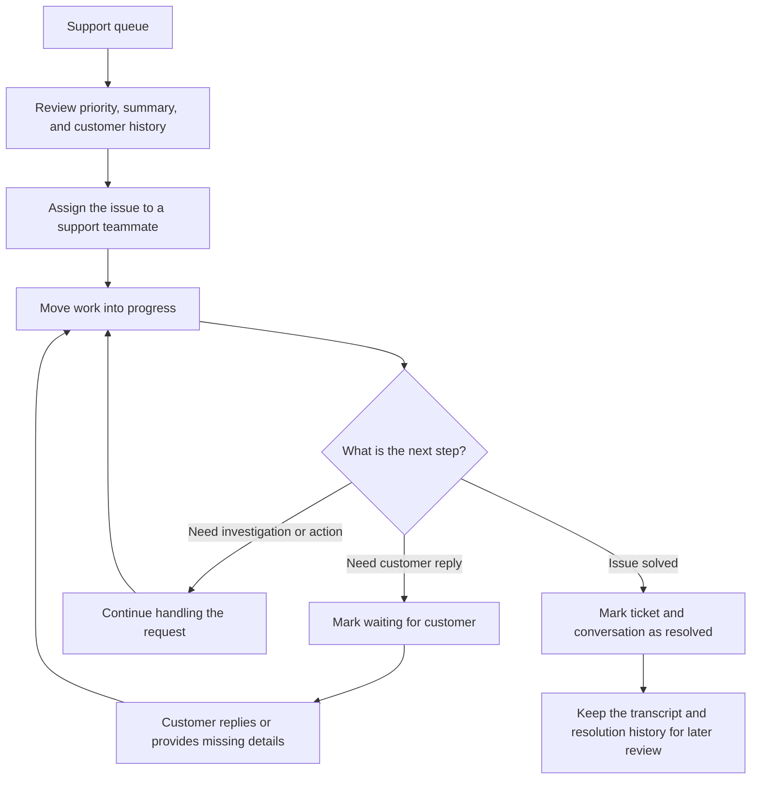

# ShopAssist AI


I built ShopAssist AI to explore what a production-minded AI support workflow for e-commerce can look like. The project combines customer self-service, grounded support answers, order-aware automation, and a human support queue that keeps context attached when the assistant should stop and hand off.

## What the product does

- answers support questions with knowledge-backed and product-aware context
- handles order tracking, returns, refunds, and shipping issues
- asks for clarification when order details or customer details are missing
- escalates unresolved issues into tickets with transcript and issue context
- gives support teammates a focused admin workspace for triage and follow-up
- protects the admin workspace with backend-verified support access

## Core workflows

### How the assistant handles a customer request



### How support follow-up moves through the queue



## Highlights

- customer chat at `/` with quick actions and optional order context
- support workspace at `/admin` with protected access, queue status, and ticket actions
- provider-based AI layer with `OpenAI`, `Anthropic`, `Gemini`, and `mock` mode
- Supabase-backed persistence for conversations, messages, tickets, and admin access rules
- support ticket escalation for missing delivery, damaged item, wrong item, refund, and return flows
- CI on pull requests to `main` for lint, typecheck, tests, and builds
- EC2 deployment path for the backend and Vercel deployment path for the frontend

## Suggested screenshots for the public README

I recommend replacing or extending the preview image above with three real product screenshots before publishing widely.

### 1. Customer self-service answer

Show:

- the customer chat UI
- an order-aware answer
- no escalation yet

Suggested prompt:

```text
Where is my order ORD-1001?
```

Good screenshot outcome:

- the assistant answers directly
- tracking or delivery status is visible
- the UI looks like self-service support, not a generic chatbot

### 2. Escalation from chat to support

Show:

- the assistant recognizing a higher-risk issue
- the conversation moving toward human follow-up

Suggested prompt:

```text
My order says delivered but I did not receive it. ORD-1001
```

Good screenshot outcome:

- the assistant explains the next step clearly
- the reply suggests handoff or support follow-up
- the context feels operational, not just conversational

### 3. Admin ticket workflow

Show:

- the `/admin` ticket or conversation view
- assignee, status, and ticket context
- one ticket in progress or waiting on customer

Good screenshot outcome:

- the queue is populated
- the ticket detail panel is visible
- linked order context and current status can be seen quickly

## Sample demo conversations

These are the best prompts to prepare before taking screenshots or recording a demo.

### Customer support answer

```text
Where is my order ORD-1001?
```

### Return eligibility

```text
Can I return order ORD-1005?
```

### Refund status

```text
Has my refund been processed for ORD-1004?
```

### Missing delivery escalation

```text
My order says delivered but I did not receive it. ORD-1001
```

### Damaged item escalation

```text
My order arrived damaged. ORD-1006
```

## Tech stack

- Frontend: React, TypeScript, Vite
- Backend: NestJS, TypeScript
- Persistence and auth: Supabase / PostgreSQL
- AI providers: OpenAI, Anthropic, Gemini, mock provider
- Testing: Jest
- CI: GitHub Actions

## Project structure

```text
/frontend
/backend
/supabase
/data
/docs
/deploy
```

## Local development

### 1. Install dependencies

```bash
npm install
```

### 2. Start local Supabase

```bash
supabase start
supabase db reset
supabase status
```

Schema and sample data are managed through:

- `supabase/migrations`
- `supabase/seed.sql`

### 3. Configure frontend

```bash
cp frontend/.env.example frontend/.env
```

Set:

```bash
VITE_API_BASE_URL=http://localhost:3000/api
VITE_SUPABASE_URL=http://127.0.0.1:55321
VITE_SUPABASE_ANON_KEY=your_publishable_key
VITE_ADMIN_ALLOW_SIGNUP=false
```

### 4. Configure backend

```bash
cp backend/.env.example backend/.env
```

For Gemini:

```bash
AI_PROVIDER=gemini
GEMINI_API_KEY=your_key_here
GEMINI_MODEL=gemini-2.5-flash
SUPABASE_URL=http://127.0.0.1:55321
SUPABASE_SERVICE_ROLE_KEY=your_service_role_key
```

For a no-key demo:

```bash
AI_PROVIDER=mock
```

### 5. Run the apps

```bash
npm run dev:backend
npm run dev:frontend
```

The frontend runs at `http://localhost:5173` and the backend runs at `http://localhost:3000/api`.

## Admin access model

The customer experience stays public at `/`. The admin workspace at `/admin` is protected in two layers:

- Supabase Auth verifies the signed-in user
- the backend checks that the email is approved in `support_admin_emails`

Open self-sign-up for admins is disabled by default. For production-style use, provision the support account first and then sign in.

## API summary

- `POST /api/chat`
- `POST /api/tickets`
- `GET /api/health`
- `GET /api/admin/session`
- `GET /api/admin/dashboard`
- `GET /api/conversations/recent`
- `GET /api/conversations/:sessionId/messages`
- `GET /api/tickets/open`
- `PATCH /api/tickets/:id`

## Deployment

### Frontend

The frontend is prepared for Vercel.

Required environment variables:

```bash
VITE_API_BASE_URL=https://your-backend-url/api
VITE_SUPABASE_URL=https://your-supabase-project-url
VITE_SUPABASE_ANON_KEY=your_supabase_anon_key
VITE_ADMIN_ALLOW_SIGNUP=false
```

If a shared Vercel URL asks visitors to sign in with Vercel first, the project is using deployment protection on preview builds. For a public demo, either:

- share the production deployment URL
- attach a public custom domain
- disable preview protection in the Vercel project settings

### Backend

The backend is prepared for an `EC2 + PM2 + Nginx` deployment.

Deployment assets:

- `docs/deployment-ec2.md`
- `backend/ecosystem.config.cjs`
- `backend/.env.production.example`
- `deploy/nginx/shopassist-api.conf`

Recommended production shape:

- frontend on Vercel
- backend on EC2
- database and auth on Supabase

## CI

GitHub Actions runs on pull requests to `main` and checks:

- linting
- typechecking
- backend tests
- frontend and backend builds

Local equivalents:

```bash
npm run lint
npm run typecheck
npm run test
npm run build
```

## Notes

- the in-memory fallback is for local demo convenience; persistent environments should use Supabase
- the repo includes demo commerce data to exercise support flows end to end
- if you are evaluating the public deployment, use the production URL rather than a protected Vercel preview link
