# ShopAssist AI

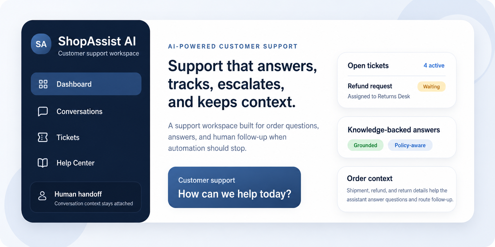

ShopAssist AI is a full-stack customer support platform for e-commerce teams. It combines a React customer chat experience, a NestJS API, Supabase/PostgreSQL persistence, and a provider-based LLM layer that supports OpenAI, Anthropic, Gemini, and a local mock mode for development.

## What the product does

ShopAssist AI helps e-commerce teams answer customer questions, keep conversation context, and escalate issues that need human follow-up.

- Answers support questions using knowledge-backed and product-aware context
- Handles order tracking, returns, refunds, and shipping questions
- Asks for clarification when order or customer details are missing
- Logs conversations so support history and context are preserved
- Escalates unresolved issues into tickets with transcript and issue context
- Gives support teammates a focused admin workspace for triage and follow-up
- Protects the admin workspace with backend-verified support access

## What this project demonstrates

This project shows practical engineering work needed for AI-enabled support automation.

- Clean backend architecture with NestJS modules and services
- Supabase/PostgreSQL persistence for conversations, messages, and tickets
- Provider-based LLM integration for OpenAI, Anthropic, Gemini, and local mock responses
- Production-minded configuration, validation, and error handling
- Separation between customer-facing chat and internal support workflows

## Core workflows

### How the assistant handles a customer request

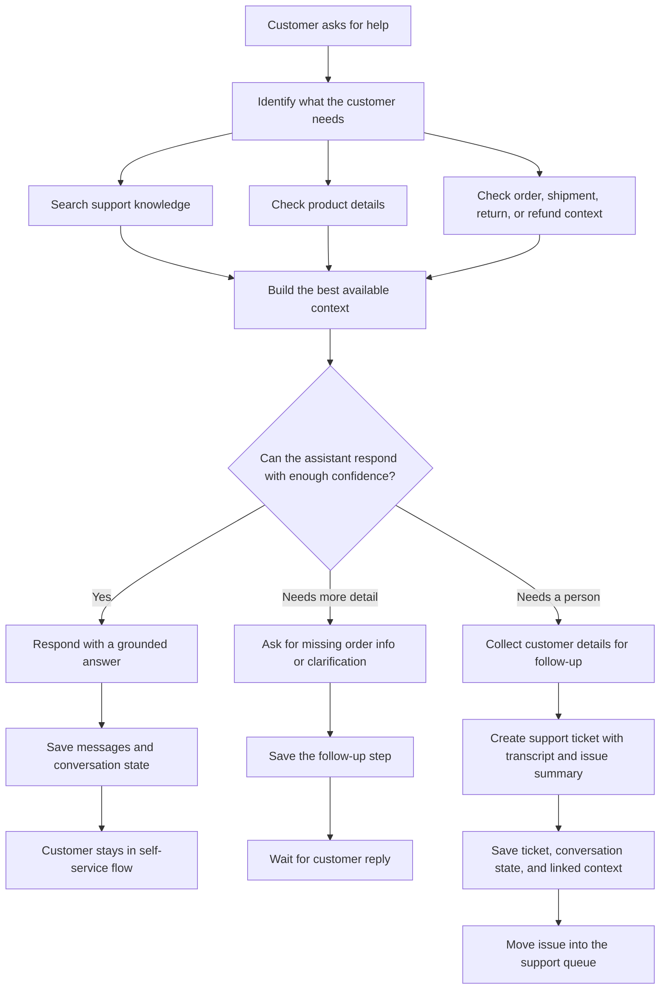

### How support follow-up moves through the queue

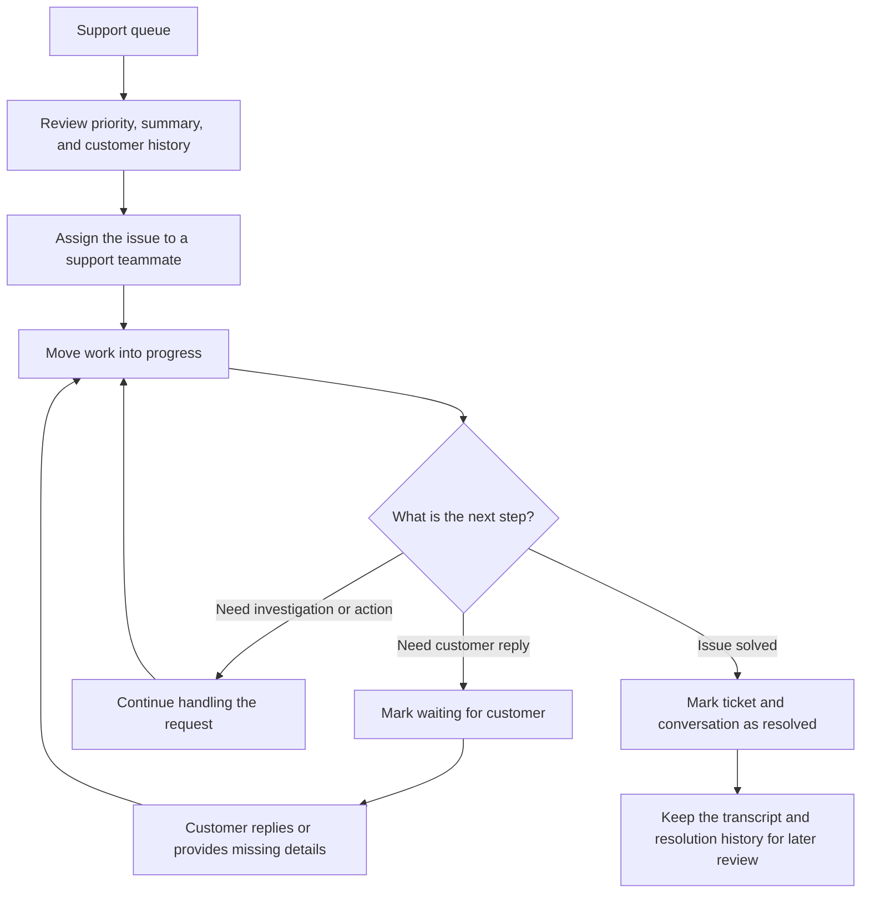

## Tech stack

- Frontend: React, TypeScript, Vite, clean custom CSS
- Backend: NestJS, TypeScript
- Database: Supabase / PostgreSQL
- AI: OpenAI, Anthropic/Claude, Gemini, provider-based architecture
- Testing: Jest unit tests for backend chat flow
- CI: GitHub Actions for lint, typecheck, tests, and builds on PRs to `main`

### AI provider architecture

The controller never calls a model SDK directly. `ChatService` depends on `AiService`, which selects a provider based on environment variables:

- `AI_PROVIDER=openai`
- `AI_PROVIDER=anthropic`
- `AI_PROVIDER=gemini`
- `AI_PROVIDER=mock`

## Local development

### 1. Install dependencies

```bash
npm install
```

### 2. Start local Supabase

```bash
supabase start
supabase db reset
supabase status
```

Schema and sample data are managed through:

- `supabase/migrations`
- `supabase/seed.sql`

### 3. Configure frontend

```bash
cp frontend/.env.example frontend/.env
```

Set:

```bash
VITE_API_BASE_URL=http://localhost:3000/api
VITE_SUPABASE_URL=http://127.0.0.1:55321
VITE_SUPABASE_ANON_KEY=your_publishable_key
VITE_ADMIN_ALLOW_SIGNUP=false
```

### 4. Configure backend

```bash
cp backend/.env.example backend/.env
```

For Gemini:

```bash
AI_PROVIDER=gemini
GEMINI_API_KEY=your_key_here
GEMINI_MODEL=gemini-2.5-flash
SUPABASE_URL=http://127.0.0.1:55321
SUPABASE_SERVICE_ROLE_KEY=your_service_role_key
```

For a no-key demo:

```bash
AI_PROVIDER=mock
```

### 5. Run the apps

```bash
npm run dev:backend
npm run dev:frontend
```

The frontend runs at `http://localhost:5173` and the backend runs at `http://localhost:3000/api`.

## Admin access model

The customer experience stays public at `/`. The admin workspace at `/admin` is protected in two layers:

- Supabase Auth verifies the signed-in user
- the backend checks that the email is approved in `support_admin_emails`

RLS is enabled for the application tables, for authenticated admin access.

Customer-facing endpoints also include basic request rate limiting to reduce spam and abusive traffic.

Open self-sign-up for admins is disabled by default. For production-style use, provision the support account first and then sign in.

If you explicitly want the local self-sign-up flow for testing, set:

```bash
VITE_ADMIN_ALLOW_SIGNUP=true
```
and temporarily re-enable signups in [`supabase/config.toml`](supabase/config.toml).

## API summary

- `POST /api/chat`
- `POST /api/tickets`
- `GET /api/health`
- `GET /api/admin/session`
- `GET /api/admin/dashboard`
- `GET /api/conversations/recent`
- `GET /api/conversations/:sessionId/messages`
- `GET /api/tickets/open`
- `PATCH /api/tickets/:id`

## CI workflow

GitHub Actions is configured in [`.github/workflows/ci.yml`](.github/workflows/ci.yml).

It runs on every pull request targeting `main` and checks:

- linting
- TypeScript typechecking
- backend tests
- frontend and backend builds

Local equivalents:

```bash
npm run lint
npm run typecheck
npm run test
npm run build
```

## Deployment

### Frontend

The frontend is prepared for Vercel.

Required environment variables:

```bash
VITE_API_BASE_URL=https://your-backend-url/api
VITE_SUPABASE_URL=https://your-supabase-project-url
VITE_SUPABASE_ANON_KEY=your_supabase_anon_key
VITE_ADMIN_ALLOW_SIGNUP=false
```
### Backend

The backend is prepared for AWS `EC2 + PM2 + Nginx` deployment.

Deployment assets:

- `docs/deployment-ec2.md`
- `backend/ecosystem.config.cjs`
- `backend/.env.production.example`
- `deploy/nginx/shopassist-api.conf`

## Screenshots

- Customer self-service answer

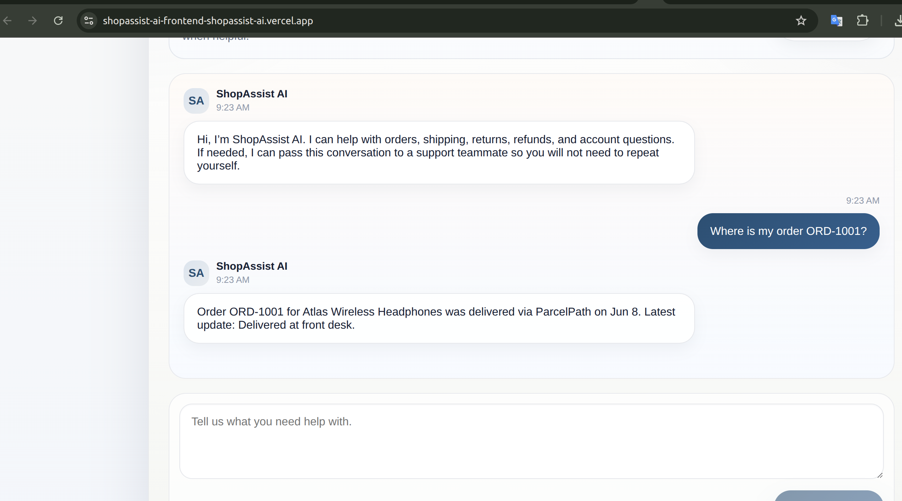

- Escalation from chat to support

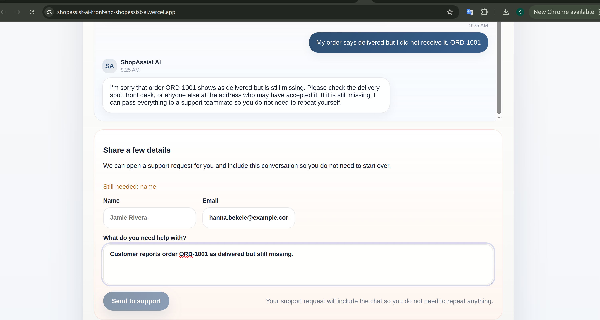


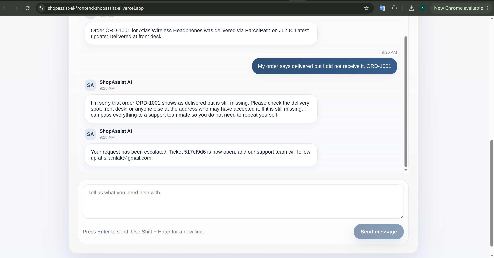

- Admin ticket workflow

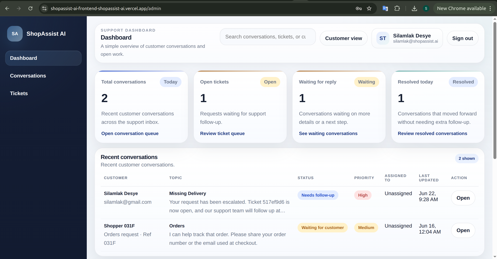

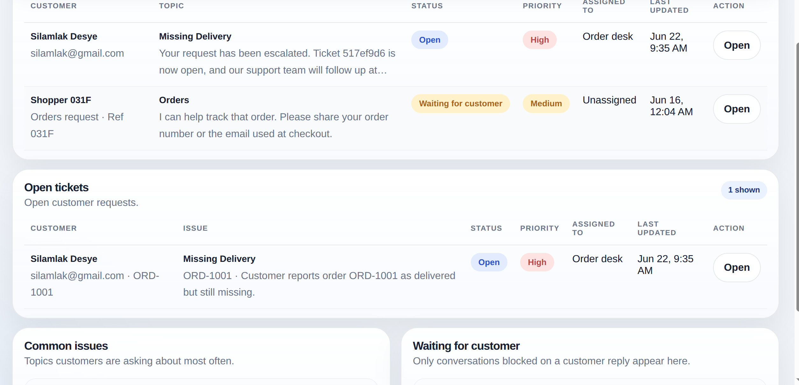

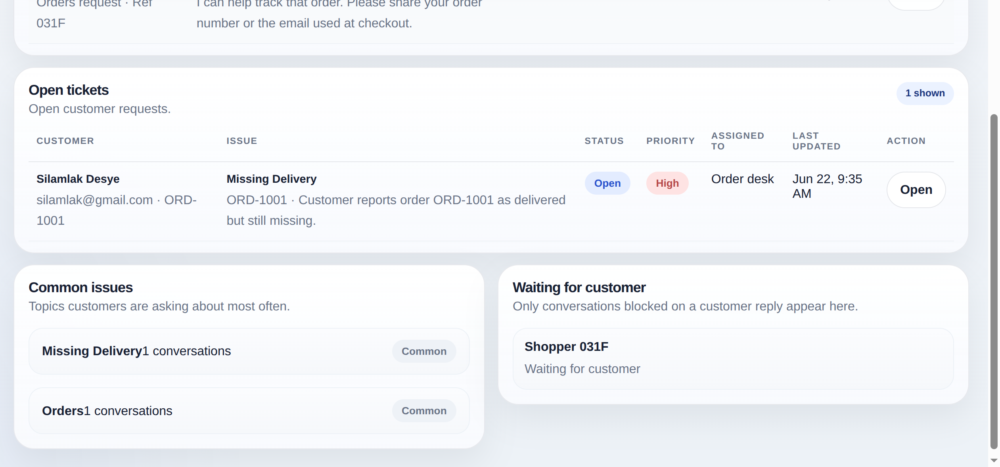

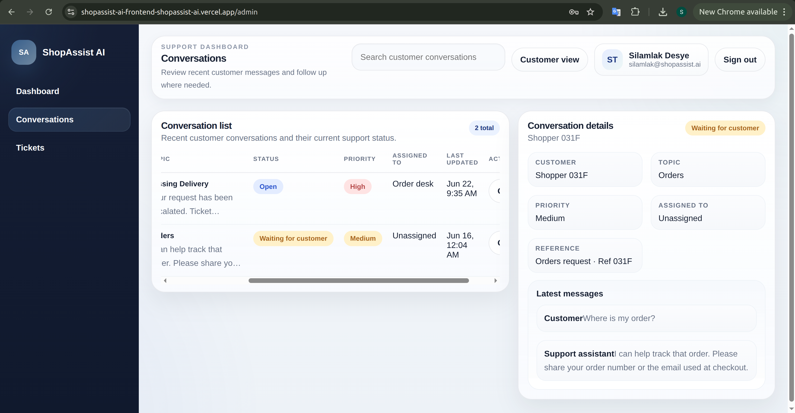

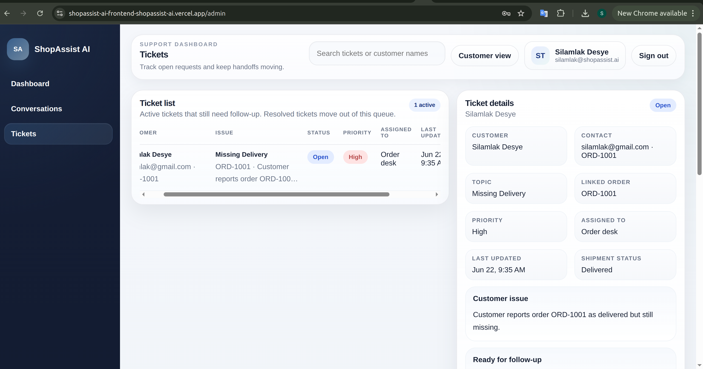

## Future improvements

- pgvector / RAG search over larger support knowledge bases
- Slack or email notifications for new tickets
- n8n workflow integration for escalations and CRM sync
- Stripe subscription gate for SaaS-style monetization
- multilingual support
- expanded analytics dashboard
- voice agent version with Vapi, ElevenLabs, or Twilio
